# TeamManagerPro


## 🚀 Aplicación en vivo

La aplicación está desplegada y disponible en:  
[https://www.teammanagerpro.es](https://www.teammanagerpro.es)

---

## 🧪 Credenciales de demostración

- **Usuario:** `demo@example.com`
- **Contraseña:** `password123`

---

## ℹ️ Descripción

**TeamManagerPro** es una aplicación web para entrenadores de fútbol que permite gestionar equipos, jugadores, partidos y estadísticas. Cuenta con un alineador táctico interactivo y un completo sistema de estadísticas para analizar el rendimiento de los jugadores.

---

## 🔧 Requisitos previos

- PHP >= 8.1
- Composer
- Node.js y npm
- Git
- SQLite o MySQL

---

## 🛠️ Instalación local

1. **Clonar el repositorio**
    ```bash
    git clone https://github.com/tuusuario/ProyectoFinalTeamManagerPro.git
    cd ProyectoFinalTeamManagerPro
    ```

2. **Instalar dependencias de PHP**
    ```bash
    composer install
    ```

3. **Instalar dependencias de JavaScript**
    ```bash
    npm install
    ```

4. **Configurar el entorno**
    Copia el archivo `.env.example` a `.env` y edítalo para configurar tu conexión a la base de datos.

5. **Configurar la base de datos**
    Edita el archivo `.env` para establecer los parámetros de conexión.

6. **Ejecutar migraciones y datos de prueba**
    ```bash
    php artisan migrate --seed
    ```
    > **Nota:** Si la base de datos SQLite no existe, Laravel te dará la opción de crearla automáticamente durante la migración.

7. **Crear enlace simbólico para almacenamiento**
    Este paso es crucial para que funcione correctamente el guardado de imágenes de alineaciones.
    ```bash
    php artisan storage:link
    ```

8. **Compilar assets**
    ```bash
    npm run build
    ```

9. **Iniciar el servidor de desarrollo**
    ```bash
    php artisan serve
    ```

10. **Acceder a la aplicación**
     Abre tu navegador y visita: [http://localhost:8000](http://localhost:8000)

---

## 📊 Características principales

- Gestión de equipos en diferentes formatos (F5, F7, F8, F11)
- Sistema de jugadores con estadísticas específicas por posición
- Alineador táctico interactivo con funcionalidad drag-and-drop
- Gestión de partidos amistosos y competiciones de liga
- Sistema detallado de estadísticas y rendimiento

---

## 📝 Nota para evaluadores

Este proyecto ha sido desarrollado como Trabajo Final para el ciclo formativo de Desarrollo de Aplicaciones Web (DAW). La aplicación está completamente funcional y desplegada en Azure App Service para facilitar su evaluación.

---

## 👨‍💻 Desarrollado por

**Marc Cañadas Suau**

- [GitHub](https://github.com/mcanadas-dawi)
- [LinkedIn](https://linkedin.com/in/marc-cañadas-suau-3911b7261/)

---

## 📄 Licencia

Este proyecto está licenciado bajo la [Licencia MIT](https://app.copyrighted.com/work/nF9nBQb5OCQyBWX4/?url=https%3A%2F%2Fwww.teammanagerpro.es%2F).

## 🧑‍💻 Historias de usuario

### 1. Registrarse
Si desea acceder a la aplicación, deberá registrarse. Para hacerlo, pulse "Registrarse", introduzca los datos necesarios y, finalmente, pulse el botón "Registrarse".

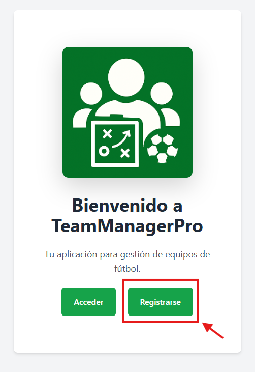

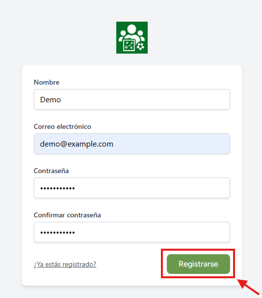

### 2. Acceder
Si ya está registrado, pulse "Acceder" e introduzca sus credenciales. Puede marcar "Recuérdame" para no tener que introducir sus credenciales constantemente en el mismo dispositivo. Finalmente, pulse "Iniciar sesión" para acceder a la aplicación.

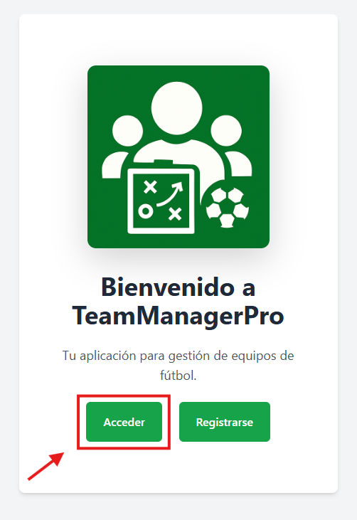


### 3. Crear Plantilla
Si desea añadir una nueva plantilla, pulse el botón "Añadir nueva plantilla", introduzca un nombre, seleccione la modalidad y pulse "Crear plantilla". Puede ocultar o mostrar este formulario pulsando nuevamente "Añadir nueva plantilla".

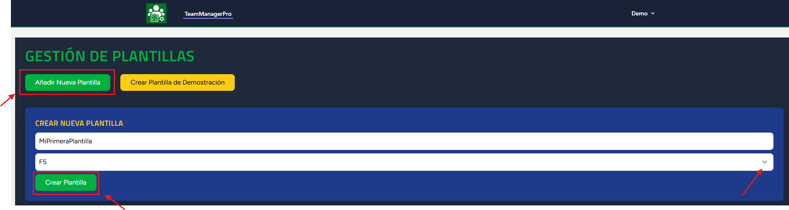

### 4. Crear Plantilla Demo (con datos aleatorios)
Si desea crear una nueva plantilla con datos de demostración, pulse "Crear plantilla de demostración". Mediante el seeder, se creará una plantilla con jugadores, liga y estadísticas coherentes.

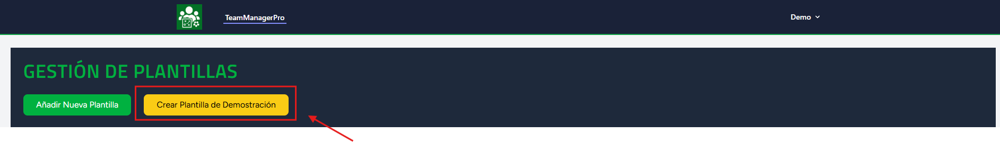

### 5. Eliminar Plantilla
Si desea eliminar alguna de sus plantillas, podrá hacerlo tanto desde la página "Gestión de plantillas" como desde la propia plantilla. En ambos casos, le aparecerá un mensaje de confirmación en el navegador para asegurarse de que desea eliminar la plantilla.

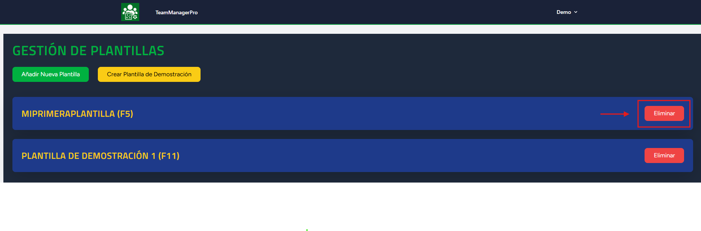

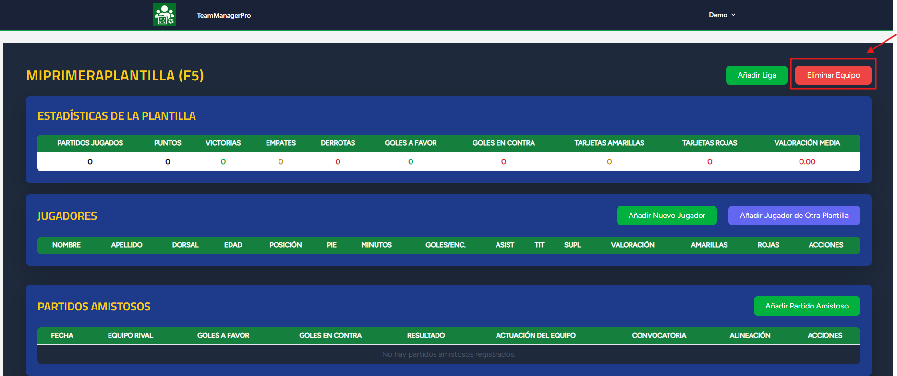

### 6. Acceder a la plantilla
Si desea acceder a su plantilla, simplemente pulse sobre el nombre de esta.

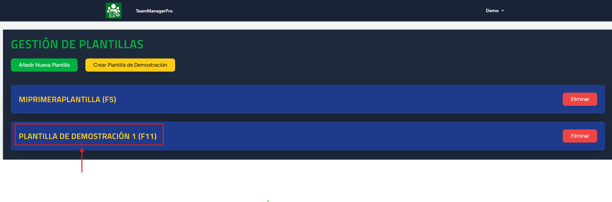

### 7. Crear nuevo jugador
Si desea añadir un nuevo jugador, una vez dentro de la plantilla, en el apartado "Jugadores", pulse "Añadir nuevo jugador", introduzca sus datos y pulse "Guardar". El jugador aparecerá en las tablas automáticamente.

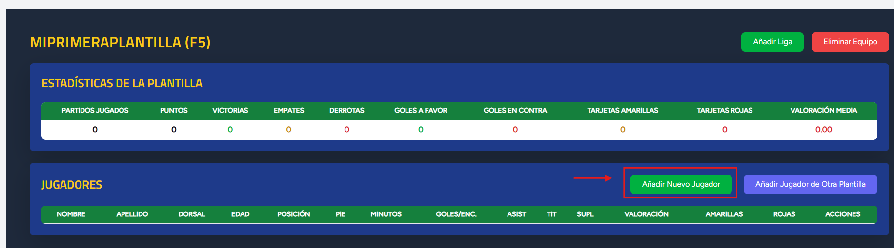

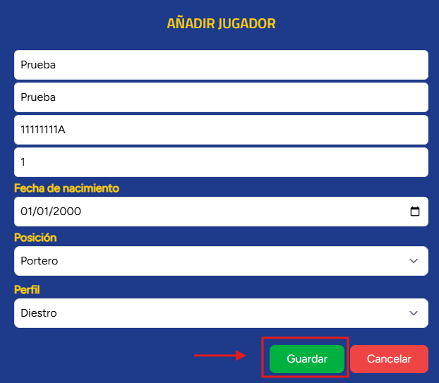

### 8. Añadir jugador existente en otra plantilla
Si desea añadir uno o más jugadores existentes (es decir, jugadores que ya pertenecen a otra plantilla), en el apartado "Jugadores", pulse "Añadir jugador de otra plantilla" y seleccione los jugadores que desee añadir mediante los "checkboxes". Tiene la posibilidad de "Seleccionar todos". Una vez seleccionados, pulse "Añadir jugadores". Los jugadores aparecerán en las tablas automáticamente.

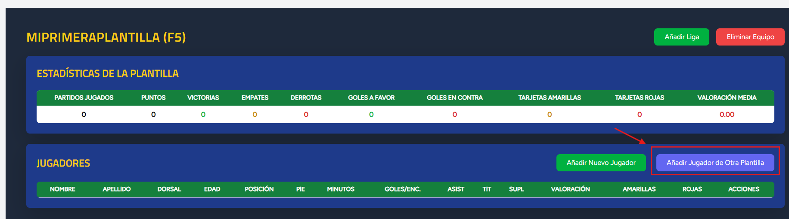

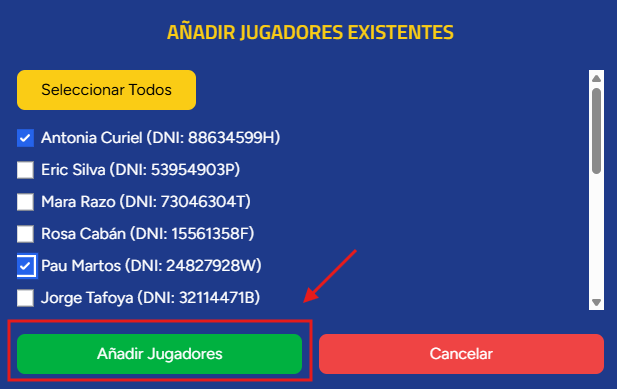

### 9. Eliminar jugador
Si desea eliminar un jugador de la plantilla, puede hacerlo fácilmente desde la sección "Jugadores", pulsando "Eliminar" en la fila del jugador que desea borrar y confirmando el mensaje del navegador.

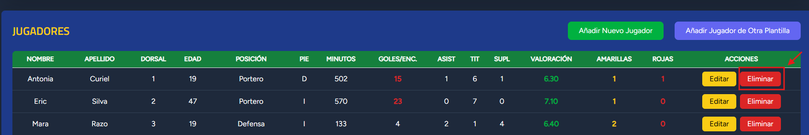

### 10. Editar jugador
Si desea editar la posición del jugador, pulse el botón "Editar" en la fila del jugador deseado, seleccione su nueva posición y pulse "Guardar". Los demás campos no son editables. Si ha cometido un error al introducir los datos, deberá eliminar al jugador y crear uno nuevo.

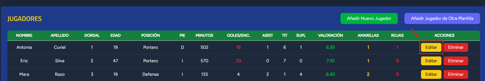

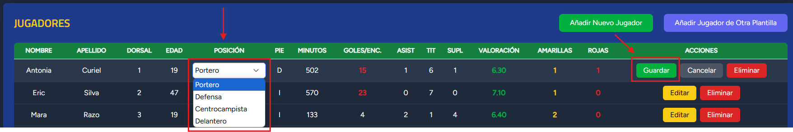

### 11. Añadir amistoso
Si desea crear un partido amistoso, en la sección "Partidos Amistosos", pulse el botón "Añadir partido amistoso", introduzca el nombre del rival y la fecha del partido y pulse "Guardar". El amistoso aparecerá en esta sección.

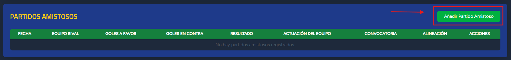

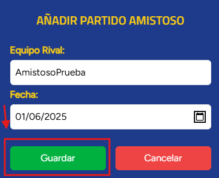

### 12. Editar Amistoso
Si desea editar un partido amistoso, en la sección "Partidos Amistosos", pulse "Editar" y podrá modificar la fecha, introducir el resultado del partido (goles a favor y en contra, lo que generará el resultado automáticamente) y la valoración del equipo. Pulse "Guardar" para preservar los cambios.

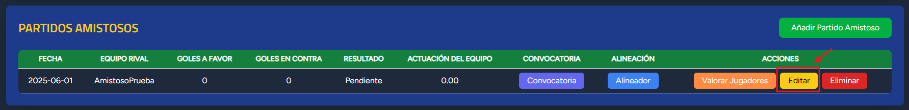

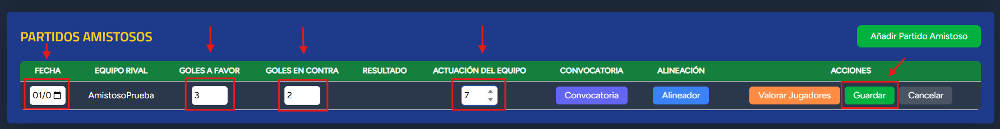

### 13. Eliminar amistoso
Si desea eliminar un amistoso, en la sección "Partidos Amistosos", pulse "Eliminar" y confirme el mensaje del navegador.

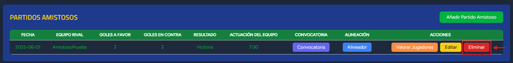

### 14. Añadir Liga ida y vuelta
Para crear los paritdos de Liga siga los siguientes pasos: 
1. En la plantilla, pulse "añadir liga".

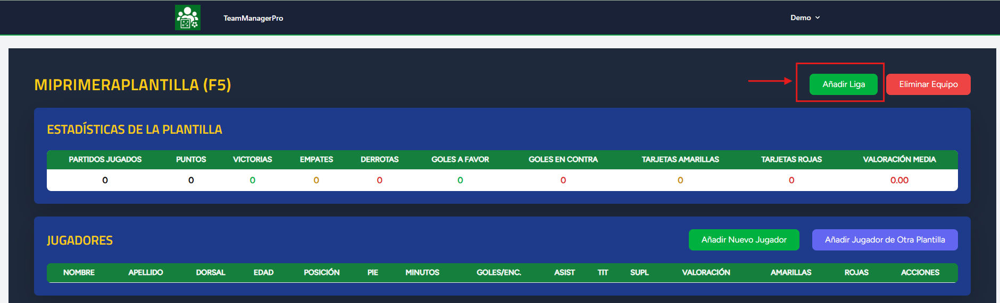

2. Añada un nombre a la Liga y el número de rivales que participan (sin contar su propio equipo)

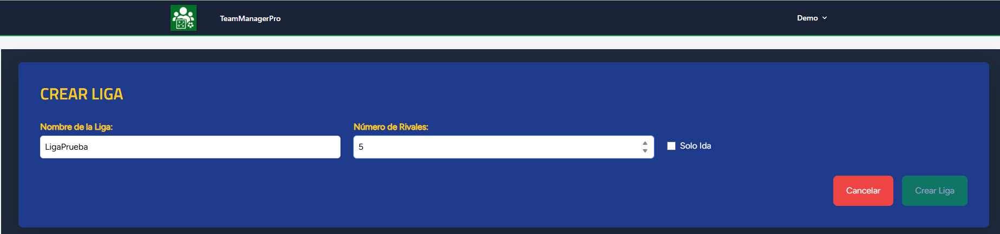

3. Introduzca el nombre de sus rivales por orden de calendario y marque los partidos donde su equipo juegue en casa. La segunda vuelta se generará automáticamente.

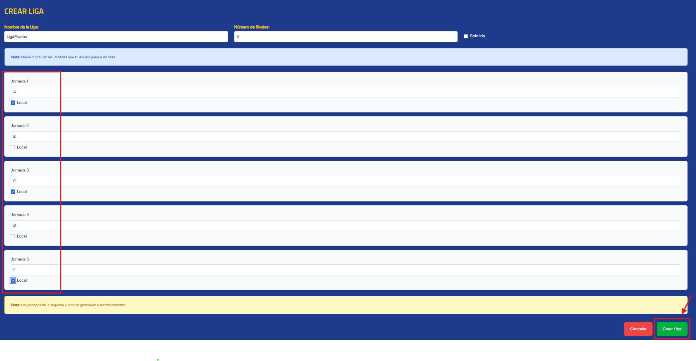

4. Los partidos aparecerán en la sección "Partidos de Liga".

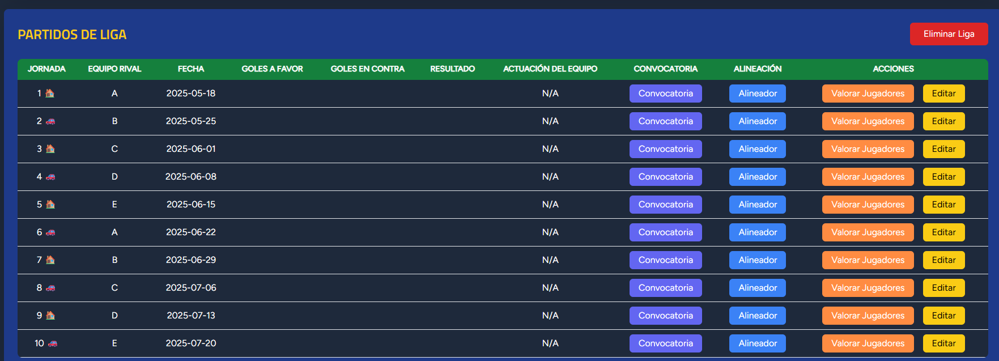


### 15. Añadir Liga solo ida
Si desea añadir una liga donde solo se juegue una vuelta (sin doble enfrentamiento), siga los pasos anteriores y marque el checkbox "Solo ida".

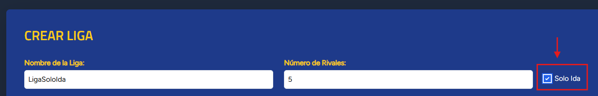

### 16. Editar partido de liga
Si desea editar la fecha de un partido de liga, introducir su resultado (goles a favor y en contra) o valorar la actuación del equipo, en la sección "Partidos de liga" pulse el botón "Editar", introduzca los campos editables (recuerde que el resultado se generará de forma automática cuando introduzca los goles) y pulse "Guardar".

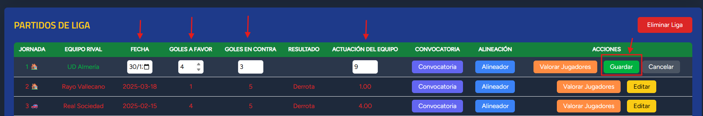

### 17. Eliminar Liga
Si desea eliminar la liga, en la sección "Partidos de liga" pulse el botón "Eliminar liga" y confirme el mensaje del navegador.

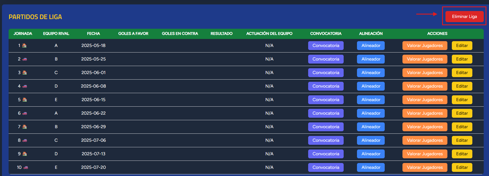

### 18. Convocatoria para partido
Si desea seleccionar los jugadores que participarán en un partido en concreto, diríjase al partido (amistoso o de liga) y pulse "Convocatoria". Una vez dentro del modal, seleccione los jugadores que serán convocados y pulse "Guardar convocatoria". Si desea cambiarla, vuelva a entrar y repita el proceso.


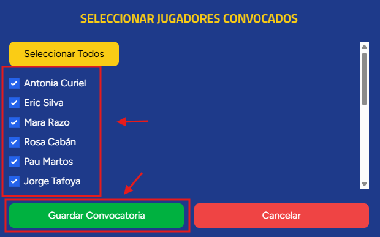

### 19. Alineación para partido
Si desea realizar su alineación inicial y plasmarla en un campo de fútbol, diríjase al partido (amistoso o de liga) y pulse "Alineador". En el modal, seleccione la formación que desee y arrastre los jugadores convocados a sus posiciones en el campo o a la lista de suplentes. Si desea mover los jugadores por el campo, pulse "Editar formación", lo cual le permitirá mover los círculos libremente. Una vez finalice, pulse "Guardar formación". Podrá guardar o descargar la alineación (se descargará como imagen).

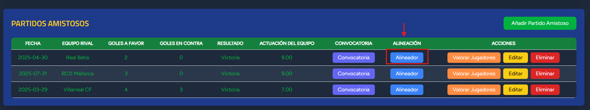


Si accede a un partido con una formación guardada, le aparecerá dicha alineación con los jugadores titulares y suplentes. Puede volver a crearla pulsando "Modificar alineación".

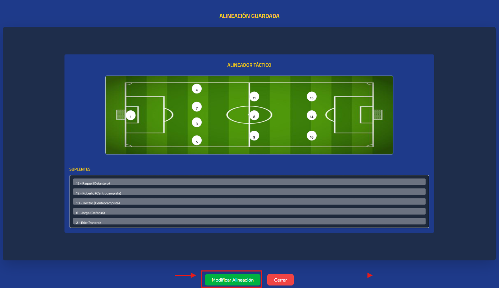


### 20. Valoración post partido
Si desea valorar a los jugadores una vez finalizado el partido, diríjase al partido (amistoso o de liga) y pulse "Valorar jugadores". En la nueva vista, introduzca las estadísticas para cada jugador y pulse "Guardar valoraciones". Los datos se actualizarán automáticamente en las tablas correspondientes.


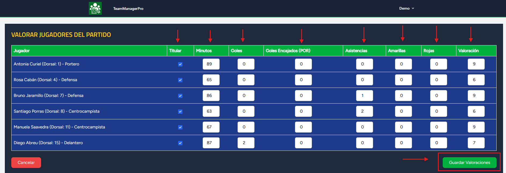

### 21. Actualizar información de perfil/contraseña/eliminar cuenta
Si desea actualizar los datos de su perfil, cambiar la contraseña o eliminar la cuenta, acceda mediante el nombre de su cuenta en la cabecera. Edite la sección deseada y pulse "Guardar", o elimine su cuenta.

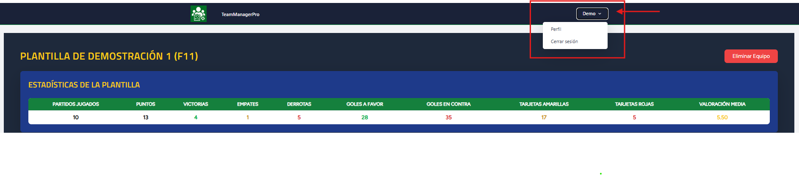

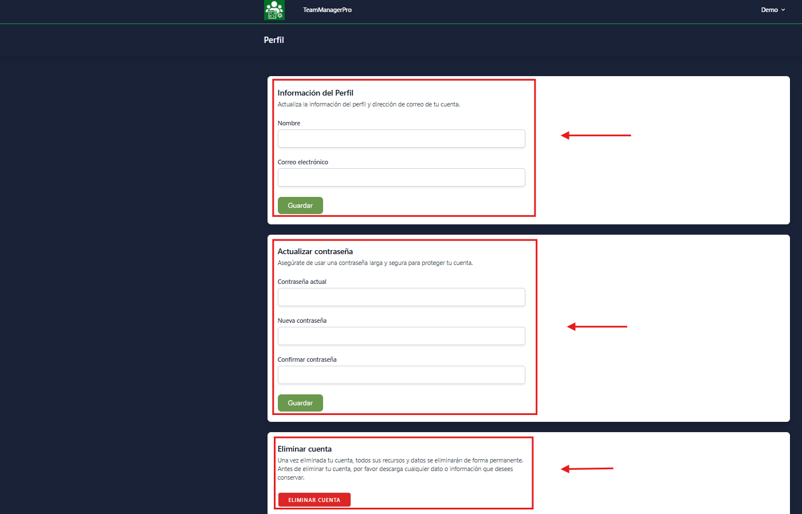

### 22. Cerrar sesión
Si desea cerrar sesión, pulse el nombre de su cuenta en la cabecera de la web y escoja "Cerrar sesión".


### 23. Regresar a la pantalla principal (administrador de plantillas)
Si desea volver a la pantalla principal, puede pulsar el logo o "TeamManagerPro", ubicado en la cabecera de la web.

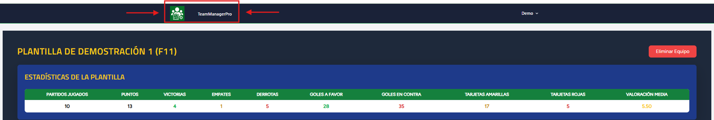
